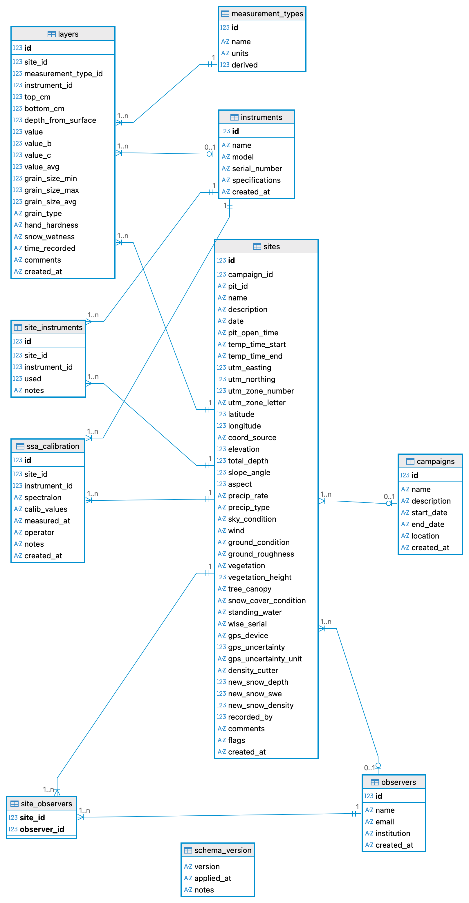

# ❄ CryoPit

A snow-pit data logger for field snow science built by the [CryoGARS research group](https://www.cryogars.com/) at the Department of Geosciences, Boise State University. CryoPit is a browser-based, OS-agnostic web app. This means that the app should run fine on any modern browser on Mac, Linux, and Windows. A [Flask](https://flask.palletsprojects.com/) (Python) backend handles storage and CSV export, while HTML/CSS/JavaScript frontend runs the form, live profile plots, and coordinate conversion entirely in the browser. CryoPit is designed so any institution or research group can deploy and adapt it.

---

## What it Does

* **Structured Field Entry**: Guided sections for identity, weather, ground, temperature, density, LWC, stratigraphy, SSA, and an instrument/task checklist.
* **Coordinates**: Enter UTM or lat/lon (WGS84); the other is computed automatically, in the browser.
* **Live Snow Profile Plot**: a miniature of the snowpack profile updates as you type, and a full profile (hand-hardness, grain type, density, temperature on a shared height axis) is available on demand; surface at top, ground at the bottom.
* **Bulk Density & SWE**: Computed live, thickness-weighted. See _Bulk density & SWE below_ on how layers with no density measurements are handled.
* **SQLite Database**: Every archived pit is saved to a relational schema (see Entity-Relationship Diagram below).
* **Exports**: SnowEx-style (https://nsidc.org/data/snex23_mar23_sp/versions/1) CSVs, either downloaded to your computer or archived to the server's export folder.

---

## Requirements
* Python 3.10+
* Dependencies are listed in **[requirements.txt](requiremets.txt)**: `flask`, `waitress`, and `python-dotenv` (optional).

Install them with 

```{bash}
pip install -r requirements.txt
```

---

## Running CryoPit on your Local Machine

```{bash}
python cryopit.py
```

Open <http://localhost:8502> (or equivalently <http://127.0.0.1:8502>); CryoPit serves on **port 8502** by default. On first run CryoPit creates the database automatically (default: `cryopit.db` in the current working directory). You can point `CRYOPIT_DB_PATH` at a different location to reuse a database across sessions or machines. The existing database must be a CryoPit-created database or at least have a compatible schema (see below), and the app needs read/write access to the path.

CryoPit serves with [waitress](https://docs.pylonsproject.org/projects/waitress/) (a production WSGI server) when it's installed. Otherwise, it falls back Flask's development server. This fallback mechanism is fine for a single local user.

### What if Port 8502 is Already in Use?

If port 8502 is occupied — almost always a previous CryoPit instance that wasn't fully closed — the app won't fail silently, it simply won't start. Either:

* Stop the old instance with **Ctrl-C** in its terminal, or
* Launch on a different port. For example, `CRYOPIT_PORT=8503 python cryopit.py`.

Stopping CryoPit with **Ctrl-C** (rather than closing the terminal window or browser tab) releases the port cleanly, so you'll rarely hit this.

---

## Deploying for Multiple Users

CryoPit can be hosted so several people reach it over a URL. See **[DEPLOYMENT.md](DEPLOYMENT.md)** on how to do that.

Two things worth knowing up front:

* **Concurrency**: SQLite runs in [Write-Ahead Logging (WAL) mode](https://sqlite.org/wal.html) with a 10 seconds busy timeout. This is enough for a small team saving occasionally. The schema is already designed to migrate to [PostgreSQL](https://www.postgresql.org/) if much higher write concurrency is ever needed. 
* **Editing on Shared Instances**: the saved-pits/edit workflow is gated by `CRYOPIT_ENABLE_EDIT` and scoped per user (i.e., each person sees and edits only their own pits). On a shared instance without authentication, leave editing off. Otherwise, all users would be able to edit any pit data. With institutional SSO in front, `CRYOPIT_ENABLE_EDIT` can be turned on safely.

---

## Using the App

1. Fill in **Identity** (location, date, and the required fields marked `*`).
   The Pit ID is generated automatically from site + date but can be edited.
2. Work through the sections. Add temperature, density, LWC, stratigraphy,
   and SSA rows as needed. The progress bar and checklist track completeness.
   - **Temperature** and **Density** can auto-generate their depth intervals
     (5 cm or 10 cm) from the total snow depth, so you only enter the readings.
   - **LWC** can copy its intervals directly from the density section.
   - The **Live Profile** rail updates as you type. The full Profile redraws when you open it or click its redraw button.
3. **Download** delivers six CSVs to your computer as ZIP. It does *_not_* write to the database, so you should _Download_ only when you want CSVs.
4. **Archive** saves the pit to the database and writes the CSVs to the server's export folder.
5. Open the **Profile** section to see the plotted snow profile.

The status indicator shows the pit's state: not archived by default, archived (green) after Archive, and downloaded (not archived; blue) after a Download. This makes it clear that downloading is not the same as recording. Starting a New pit warns you if the current one hasn't been archived.

---

## Bulk Density and SWE

CryoPit reports bulk density and SWE (snow water equivalent) live in the Live Profile rail. Here is how the numbers are calculated:

### Bulk Density is Thickness-weighted

CryoPit weights each layer by its thickness to calculate bulk density ($\rho_s$).

$$
\rho_s\ (kg/m^3) = \frac{\sum_{i=1}^n \rho_{s,i} \times t_i}{\sum_{i=1}^n t_i}
$$

where $n$ is the number of intervals for which density was measured, $t_i\ (m)$ is the thickness of the $i$th layer, and $\rho_{s,i}\ (kg/m^3)$ is the density of $i$th layer. The thickness-weighted density only matters whenever layers have different thicknesses, which is not uncommon. Otherwise, the bulk density simply collapses to the average density across all layers. As an example, consider a snowpack with the following density layering:

* 0.1 $m$ of light snow at 100 $kg/m^3$
* 0.9 $m$ of dense snow at 400 $kg/m^3$

A simple average gives:

$$
\rho_s = \frac{100 + 400}{2} = 250\ kg/m^3
$$

The thickness-weighted bulk density is:

$$
\rho_s = \frac{100 \times 0.1 + 400 \times 0.9 }{0.9 + 0.1} = 370\ kg/m^3
$$

### SWE and Intervals with Unmeasured Density

$$
\begin{aligned}
SWE\ (m) & = \sum_{i=1}^n t_i \times \frac{\rho_s}{\rho_w} \\
 & = \sum_{i=1}^n t_i \times \frac{\rho_s}{1000} \\
 & = \frac{\sum_{i=1}^n t_i}{1000} \times \frac{\sum_{i=1}^n \rho_{s,i} \times t_i}{\sum_{i=1}^n t_i} \\
 & = \frac{\sum_{i=1}^n \rho_{s,i} \times t_i}{1000} \\
 SWE\ (mm) & = \sum_{i=1}^n \rho_{s,i} \times t_i
\end{aligned}
$$

where $\sum_{i=1}^n t_i$ = $HS$ = snow depth and $\rho_w = 1000\ kg/m^3$ = density of water.

**Note on units**: CryoPit works in $cm$ and $kg/m^3$ throughout. Therefore, all depths and thicknesses should be  entered in $cm$. The formulas above are shown in metres only to keep the SWE derivation clean; you never enter or see metres in the app. The displayed SWE ($mm$) is computed from your $cm$ inputs automatically.

### Intervals with Unmeasured Density

Oftentimes, density is missing for a part of the column. This mostly occurs in the near-ground interval, where vegetation prevents sampling. In cases where there is a gap, CryoPit estimates the missing density, depending on where the gap is:

* **The Inteval Closest to the Ground**: Density is estimated using the mean of thickness-weighted measured desnities.
* **Gap Between Measured Intervals**: this is an extremely rare case. However, in case it occurs, CryoPit estimates density using carry-forward approach; i.e., the density directly above the missing interval is used.

**Note**: The estimated density is used only to compute the live SWE and bulk-density readout. Only measured data goes into the DB and CSVs. When any gap is filled, the Live Profile labels the result _estimated_ and shows how many centimetres of density were interpolated.

---

## Exports

Both Download and Archive produces the same set of **SnowEx-style CSV files** (https://nsidc.org/data/snex23_mar23_sp/versions/1), one per measurement category. Files are named:

```
{CAMPAIGN}_{PitID}_{YYYYMMDD}_{parameter}_v01_0.csv
```

For example, `SNEX26_GM1_20260210_density_v01_0.csv`. The six files are:

| File | Contents |
|---|---|
| `…_siteDetails_…` | Site metadata: location, coordinates, observers, weather, ground, equipment, instrument log |
| `…_density_…` | Density by interval (samples A/B/C) |
| `…_temperature_…` | Temperature profile by depth |
| `…_LWC_…` | Liquid water content / permittivity (A/B) |
| `…_stratigraphy_…` | Layers: grain type, grain size, hand hardness, wetness |
| `…_SSA_…` | Specific surface area, with calibration metadata |

All six files are always produced. For a measurement that wasn't collected, its file contains the header block and column titles but no data rows. Missing values within a file are written as `-9999` (the SnowEx no-data convention). Download bundles all six into one file: `{CAMPAIGN}_{PitID}.zip`. **Archive** writes the six files into a per-pit subfolder of the export directory (`{CAMPAIGN}_{PitID}_{YYYYMMDD}/`).

---

## Configuration

CryoPit reads these environment variables (all optional, defaults shown). You can set them in a `.env` file in the project directory.

| Variable | Default | Purpose |
|---|---|---|
| `CRYOPIT_HOST` | `127.0.0.1` | Bind address; set `0.0.0.0` to accept network connections |
| `CRYOPIT_PORT` | `8502` | Port to serve on |
| `CRYOPIT_DB_PATH` | `cryopit.db` | SQLite database file (created if absent; must be a CryoPit DB if it exists) |
| `CRYOPIT_EXPORT_DIR` | `exports` | Folder that **Archive** writes CSVs to |
| `CRYOPIT_ENABLE_EDIT` | `true` | Saved-pits sidebar + load-for-edit on/off |
| `CRYOPIT_SAVED_PITS_LIMIT` | `10` | How many recent pits the sidebar shows (per user) |
| `CRYOPIT_AUTH_HEADER` | `X-Remote-User` | Header a reverse proxy injects with the authenticated username |
| `CRYOPIT_DEV_USER` | `local` | Owner used when no auth header is present |
| `CRYOPIT_THREADS` | `8` | waitress worker threads |
| `CRYOPIT_RESEARCH_GROUP` | `CryoGARS` | Research group (shown in the in-app topbar) |
| `CRYOPIT_INSTITUTION` | `Boise State University` | Institution / university (shown in the browser tab title) |
| `CRYOPIT_CAMPAIGN` | Current water year; e.g.,`WY2026` | Default campaign code. Set this to pin a fixed value |

In any server or Docker deployment, set `CRYOPIT_DB_PATH` and `CRYOPIT_EXPORT_DIR` to explicit absolute paths (or a mounted volume), so data doesn't land in an unexpected working directory.

> **Important**: The database must be on a real local disk. Do not point `CRYOPIT_DB_PATH` at a Google Drive / Dropbox-synced folder or a network filesystem. CryoPit uses SQLite in  [Write-Ahead Logging (WAL) mode](https://sqlite.org/wal.html), and a sync client copying the database files at the wrong moments will corrupt them. The export folder (CRYOPIT_EXPORT_DIR) has no such restriction: CSVs are static files, so a Drive-mounted folder is fine for them.

---

## Entity-Relationship Diagram

The proposed ER diagram for CryoPit is below. This schema is the same as the [SnowEx DB's schema](https://snowexsql.readthedocs.io/en/latest/database_structure.html) with some modifications/extensions. The core tables — `campaigns`, `sites`, `layers`, `measurement_types`, `instruments`, `observers`, and `site_observers` — map directly to their SnowEx equivalents. CryoPit extends the schema in two ways:

1. `site_instruments` is a CryoPit-specific table that logs which instruments were deployed at each pit, including serial their serial numbers; this information is exported as part of the siteDetails CSV.;
2. `ssa_calibration` stores IceCube/IRIS calibration data (Spectralon reference levels and voltage readings) per pit; 

Fields not present in the SnowEx schema, such as `pit_open_time`, `temp_time_start`, `temp_time_end`, `wise_serial`, `gps_device`, `density_cutter`, `snow_cover_condition`, `standing_water`, etc, are retained for field workflow completeness and based on the lateest pit sheet, and are exported to the siteDetails CSV header. You can find the latest (i.e., digitized) field sheet [here](docs/reference/digitized_pit_sheet.pdf).

This version is compatible with SQLite. However, the schema is designed for PostgreSQL/PostGIS migration.

<div align="center">
  <a href="images/erd.png">
    
  </a>
</div>

---

## Querying the DB

The database is plain SQLite, so any SQLite client works. A few examples:

1. **List all pits with campaign, observer, and total depth:**

```sql
SELECT s.pit_id, s.date, c.name AS campaign, o.name AS recorded_by,
       s.total_depth, s.latitude, s.longitude
FROM sites s
LEFT JOIN campaigns c ON c.id = s.campaign_id
LEFT JOIN observers o ON o.id = s.recorded_by
ORDER BY s.date DESC;
```

2. **Density profile for one pit** (layers join `measurement_types` by name):

```sql
-- GM1 is the PIT ID
SELECT l.depth_from_surface, l.top_cm, l.bottom_cm,
       l.value AS density_a, l.value_b AS density_b, l.value_avg
FROM layers l
JOIN sites s ON s.id = l.site_id
JOIN measurement_types mt ON mt.id = l.measurement_type_id
WHERE s.pit_id = 'GM1' AND mt.name = 'density'
ORDER BY l.depth_from_surface;
```

Measurement types available for the `mt.name` filter include `temperature`, `density`, `permittivity` (LWC), `grain_size` (stratigraphy), and `ssa`.

---

## Modularity is on the Horizon

CryoPit is being built toward a modular architecture so different groups can easily adapt it to their workflows. Planned and in-progress directions:

1. **More Export Formats**: CryoPit currently exports CSVs. We plan to add more formats, such as CAAML, to improve interoperability with community tools like niViz. If you have suggestions on useful formats for the community, please raise an issue or contact the author (see contact below).
2. **Server Deployment**: The current local helper service is the part most tied to single-machine use. A deployment-ready version will move save/export to native server-side actions so CryoPit can run behind a shared server with several users at once. By deployment-ready, we mean hosting CryoPit behind a URL where several users can connect and work concurrently. For higher write concurrency, the SQLite database can migrate to PostgreSQL (the schema is already designed for this); small teams can continue on SQLite (it's fast and lightweight).
3. **Downloadable Snow Pit Profile Visualization**: Currently, CryoPit does not allow its users to download the snow pit visualization because more enhancements are planned for a future realease. Once those enhancements are finalized, we will provide a download button.

---

## Contact

Ibrahim Alabi (ibrahimolalekana@boisestate.edu)