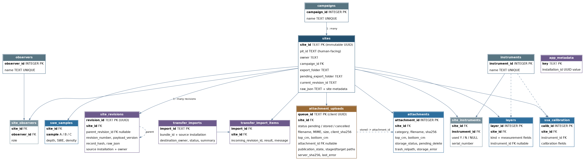

# ❄ CryoPit

A snow-pit data logger for field snow science built by the [CryoGARS research group](https://www.cryogars.com/) at the Department of Geosciences, Boise State University. CryoPit is a browser-based, OS-agnostic web app. This means that the app should run fine on any modern browser on Mac, Linux, and Windows. A [Flask](https://flask.palletsprojects.com/) (Python) backend handles storage and CSV export, while the HTML/CSS/JavaScript frontend runs the form, live profile plots, and coordinate conversion entirely in the browser. CryoPit is designed so any institution or research group can deploy and adapt it.

---

## What it Does

* **Structured Field Entry**: Guided sections for identity, weather, ground (including the interval board SWE measurement), temperature, density, LWC, stratigraphy, SSA, and an instrument/task checklist with an "Other" write-in — mirroring the [digitized field sheet](docs/reference/digitized_pit_sheet.pdf). Weather is duration-aware: select every precipitation, sky, and wind condition observed while the pit is open.
* **Coordinates**: Enter UTM or lat/lon (WGS84); the other is computed automatically, in the browser.
* **Live Snow Profile Plot**: a miniature of the snowpack profile updates as you type, and a full profile (hand-hardness, grain type, density, temperature on a shared height axis) is available on demand; surface at top, ground at the bottom.
* **Bulk Density & SWE**: Computed live, thickness-weighted. See [Bulk Density and SWE](#bulk-density-and-swe) below on how layers with no density measurements are handled.
* **SQLite Database**: Every archived pit is saved to a relational schema (see [Database Schema](#database-schema) below).
* **Exports**: SnowEx-style (<https://nsidc.org/data/snex23_mar23_sp/versions/1>) CSVs, either downloaded to your computer or archived to the server's export folder.

---

## Requirements

* Python 3.11+
* Direct dependency policy is maintained in **[requirements.txt](requirements.txt)**.
* **[requirements.lock](requirements.lock)** pins the complete tested Python environment.
* **[environment.yml](environment.yml)** defines the supported Conda environment and installs CryoPit's direct Python dependencies from `conda-forge`.

For normal CryoPit installation, choose either the standard virtual-environment path or the Conda path below. Standard `venv` and production installs use `requirements.lock`; Conda users install from `environment.yml`. CI runs the full suite through both paths.

Maintainers use `requirements.txt` when intentionally changing dependency ranges, then update/regenerate `requirements.lock`, keep the direct Conda pins in `environment.yml` aligned, and run CI through both installation paths.

---

## Running CryoPit on your Local Machine

### Option A: standard Python virtual environment

#### macOS or Linux

First confirm that `python3` is Python 3.11 or newer:

```bash
python3 --version
python3 -m venv .venv
source .venv/bin/activate
python -m pip install --upgrade pip
python -m pip install -r requirements.lock
```

#### Windows PowerShell

Run these commands from the extracted CryoPit project directory and confirm the selected Python is 3.11 or newer:

```powershell
py --version
py -m venv .venv
.\.venv\Scripts\Activate.ps1
python -m pip install --upgrade pip
python -m pip install -r requirements.lock
```

If PowerShell blocks the activation script, allow it for the current terminal only, then activate the environment again:

```powershell
Set-ExecutionPolicy -Scope Process -ExecutionPolicy Bypass
.\.venv\Scripts\Activate.ps1
```

### Option B: Conda

CryoPit includes `environment.yml` for Conda users. Conda installs Python 3.11 and CryoPit’s direct Python dependencies from `conda-forge`, including the compiled scientific and HEIC stack. No separate pip-install step is required.

From the extracted CryoPit project directory:

```bash
conda env create -f environment.yml
conda activate cryopit
python --version
```

The same commands work in Anaconda Prompt, Miniconda Prompt, or a shell where Conda has been initialized.

### Configure data paths and start CryoPit

#### macOS or Linux

```bash
mkdir -p test-data
export CRYOPIT_DB_PATH="$PWD/test-data/cryopit.db"
export CRYOPIT_EXPORT_DIR="$PWD/test-data/exports"

python -m cryopit
```

#### Windows PowerShell

```powershell
New-Item -ItemType Directory -Force .\test-data | Out-Null
$env:CRYOPIT_DB_PATH = Join-Path $PWD "test-data\cryopit.db"
$env:CRYOPIT_EXPORT_DIR = Join-Path $PWD "test-data\exports"

python -m cryopit
```

The PowerShell environment variables above apply only to that terminal window. Keep the active SQLite database on local disk rather than in OneDrive, Dropbox, Google Drive, or a network-mounted directory.

Open <http://localhost:8502> (or equivalently <http://127.0.0.1:8502>); CryoPit serves on **port 8502** by default. On first run CryoPit creates the database automatically. The commands above place it under `test-data`; without `CRYOPIT_DB_PATH`, the default is `cryopit.db` in the current working directory. You can point `CRYOPIT_DB_PATH` at a different location to reuse a database across sessions or machines. The existing database must be a CryoPit-created database or at least have a compatible schema (see below), and the app needs read/write access to the path.

CryoPit serves with [waitress](https://docs.pylonsproject.org/projects/waitress/) (a production WSGI server) when it's installed. Otherwise, it falls back to Flask's development server. This fallback mechanism is fine for a single local user. The app is also importable as a standard WSGI factory: `waitress-serve --call cryopit:make_app`.

### What if Port 8502 is Already in Use?

If port 8502 is occupied — almost always a previous CryoPit instance that wasn't fully closed — the app exits with a clear message telling you exactly that, instead of a traceback. Either:

* Stop the old instance with **Ctrl-C** in its terminal, or
* Launch on a different port. For example, `CRYOPIT_PORT=8503 python -m cryopit`.

Stopping CryoPit with **Ctrl-C** (rather than closing the terminal window or browser tab) releases the port cleanly, so you'll rarely hit this.

---

## Stage 12 release-candidate safeguards

Stage 12 hardens the existing owner-only deployment model rather than adding a
new scientific workflow. It includes owner-bound CSRF tokens, fail-closed SSO
identity handling, request and attachment limits, security headers, request IDs,
health/readiness endpoints, abuse controls, consistent backup/restore bundles,
and full route-level multi-user isolation tests. Archive publication, pit-folder
renames, attachment uploads/deletions, reconciliation, and backups also share one
storage lifecycle lock so a concurrent upload cannot recreate a pit's old folder.
Completed files and directory renames are synced on a best-effort basis for
power-loss durability.

Operational references:

* **[DEPLOYMENT.md](DEPLOYMENT.md)** — local, Docker, and institutional deployment.
* **[docs/SECURITY.md](docs/SECURITY.md)** — SSO trust boundary and authorization limits.
* **[docs/BACKUP_RESTORE.md](docs/BACKUP_RESTORE.md)** — consistent database + export backups.
* **[docs/UPGRADE_ROLLBACK.md](docs/UPGRADE_ROLLBACK.md)** — migration and rollback procedure.
* **[docs/RELEASE_CHECKLIST.md](docs/RELEASE_CHECKLIST.md)** — production acceptance checklist.

Liveness and readiness endpoints are available at `/healthz` and `/readyz`.
They intentionally expose no pit or user information.

## Stage 13 field-ready interface

Stage 13 refreshes the presentation and interaction layer without changing the
scientific calculations, database schema, archive lifecycle, attachment
consistency, or owner-scoped security model. The interface now provides a clearer
workspace hierarchy, more legible section headings and units, explicit attachment
states, dependable touch targets, responsive laptop/tablet/mobile layouts, and
stronger keyboard, focus, high-contrast, reduced-motion, and print behavior.
Profile tables also support spreadsheet-like vertical entry: Enter moves to the same input in the next existing row, while row creation remains explicit.

The app no longer requests web fonts, so its visual hierarchy remains complete
when a field laptop is offline. A small presentation-only enhancer gives form
controls dependable accessible names and marks populated field cards without
changing values or collection behavior. See **[docs/INTERFACE.md](docs/INTERFACE.md)**
for the design and accessibility contract.

## Stage 14 one-way field transfer

Stage 14 combines records from multiple independent field-laptop databases into
one authoritative institutional CryoPit installation without copying SQLite
rows. Every pit retains its immutable `site_id`; each changed scientific record
receives a globally unique revision UUID linked to its parent revision. The
central importer accepts new pits and safe fast-forward updates, skips repeated
imports idempotently, and quarantines divergent edits rather than overwriting
them.

A field laptop creates a verified transfer bundle outside its export root:

```bash
python -m cryopit.transfer export --output /transfer/field-day.zip
```

The central operator verifies and dry-runs it against a trusted SSO owner before
applying it:

```bash
python -m cryopit.transfer import /transfer/field-day.zip \
  --owner 00u81abc123 --dry-run --report /transfer/field-day-plan.json

python -m cryopit.transfer import /transfer/field-day.zip \
  --owner 00u81abc123 --report /transfer/field-day-result.json
```

Bundles carry canonical scientific JSON, revision ancestry, source-installation
provenance, attachment metadata and bytes, expected-photo queue UUIDs, and
checksums. The destination rebuilds normalized rows with local integer IDs. A
real import enters maintenance mode, uses the shared storage lifecycle lock,
publishes files recoverably, and writes bundle- and pit-level audit records.
See **[docs/MERGING.md](docs/MERGING.md)** for the complete protocol.

## Deploying for Multiple Users

CryoPit can be hosted so several people reach it over a URL. See **[DEPLOYMENT.md](DEPLOYMENT.md)** on how to do that. A ready-to-use **[Dockerfile](Dockerfile)** is included:

```bash
docker build -t cryopit .
docker run -p 8502:8502 -v cryopit-data:/data cryopit
```

The image stores the database and exports under `/data` (mount a volume there so data survives container restarts).

Three things worth knowing up front:

* **Concurrency**: SQLite runs in [Write-Ahead Logging (WAL) mode](https://sqlite.org/wal.html) with a 10 second busy timeout. This is enough for a small team saving occasionally. The schema is already designed to migrate to [PostgreSQL](https://www.postgresql.org/) if much higher write concurrency is ever needed.
* **SSO-first ownership**: the first-generation multi-user product is designed to sit behind an institution’s SSO. The saved-pits/edit workflow is gated by `CRYOPIT_ENABLE_EDIT`, and every pit operation is scoped to the stable user identity supplied by the trusted proxy. On a shared instance without authentication, leave editing off; all visitors otherwise share the configured local identity.
* **Identity is opt-in**: the SSO username header (`CRYOPIT_AUTH_HEADER`) is **ignored** unless `CRYOPIT_TRUST_PROXY_AUTH=true`. Only set that flag when an authenticating reverse proxy is the sole way to reach the app and it strips any client-supplied copy of the header; otherwise anyone on the network could impersonate anyone by sending the header themselves. Role-based supervisor and campaign access is intentionally future work; see **[docs/FUTURE_WORK.md](docs/FUTURE_WORK.md)**.
* **Worker model**: Waitress threads run in one process and share CryoPit's in-process lifecycle lock. POSIX deployments also use `flock` across processes. On Windows or a filesystem where process locking is unavailable, CryoPit warns and must run as a single application process; do not point multiple workers at the same database/export pair.

---

## Using the App

CryoPit opens on an owner-scoped workspace. Choose **Start New Pit**, return to
work already in progress, or use **Find Existing Pit** to open the Saved Pits
finder. Recent records, archive operations needing recovery, and photographs
waiting in this browser are visible without opening the field form.

1. Fill in **Identity** (location, date, and the required fields marked `*`).
   The Pit ID is generated automatically from site + date but can be edited.
2. Work through the sections (click any section header to collapse or
   expand it; the sidebar index re-expands a collapsed section). Add temperature, density, LWC, stratigraphy,
   and SSA rows as needed. The progress bar and checklist track completeness.
   - **Temperature** and **Density** can auto-generate their depth intervals
     (5 cm or 10 cm) from the total snow depth, so you only enter the readings.
   - **LWC** can copy its intervals directly from the density section, and records the LWC device and serial number used (free text, as on the sheet).
   - **Ground** includes the interval board SWE measurement (samples A/B/C with depth, SWE, and density, plus evidence-of-melt).
   - Each row table has a **⇅ sort** button that orders rows surface → ground
     on demand. It is deliberately one-way and idempotent — clicking again
     changes nothing — and never runs automatically (rows must not jump while
     you type). Exports, the figure, and the rail always sort internally
     regardless of screen order, so sorting is purely cosmetic.
   - The **Live Profile** rail updates as you type. The full Profile redraws when you open it or click its redraw button.
   - Every §9 instrument/task row has three meaningful states: **Y**, **N**, or
     **unanswered** (neither button selected). Click an already-selected Y or N
     again to retract it. CryoPit preserves that distinction in saved pits and
     writes unanswered as `-9999` in the siteDetails CSV; silence is never
     converted into an explicit No.
3. **Download** delivers seven CSVs and the profile PNG to your computer as a
   ZIP. It does *not* write to the database. Use it when you want the data
   files and nothing else — you never have to archive a pit to get its CSVs.
4. **Archive** creates a new pit. CryoPit first records the pit as pending,
   builds all required CSVs and figures in a private staging directory, then
   publishes the complete pit folder with a same-filesystem rename. The pit is
   shown as archived only after the database and final folder agree. An
   interrupted operation appears under **Needs recovery**, not in the normal
   Saved pits list.

   **Saved pits** is an owner-scoped finder rather than an unbounded list. It
   starts with the newest observation dates, searches Pit ID, site,
   location, campaign, date, recorder, and observers, and can filter by
   campaign and date range. Results load in pages and show pending-photo or
   missing-attachment status. Users can still sort by recently updated or Pit
   ID. Recovery-required archives remain in a separate **Needs recovery** section.

   Loading a record from **Saved pits** enters explicit edit mode: the banner
   names the pit being edited and the primary action becomes **Archive Changes**.
   Campaign, date, and Pit ID corrections update that same immutable pit record;
   CryoPit does not use saved pits as templates. **Start New Pit** is the only
   way to detach the form and begin a clean record. After the first successful
   archive, a non-blocking choice offers **Continue Editing** or **Start New Pit**.

   **What Download includes, and when.** The ZIP always carries the seven CSVs
   and the profile figure — those are built from what is on your screen, so
   they are there whether or not the pit has ever been archived. Photographs
   are different: they are uploaded to the server, and the server will only
   accept an upload for a pit it already has a record of. So:

   | | CSVs + profile PNG | photographs |
   |---|---|---|
   | Download before archiving | ✓ | — none exist yet |
   | Archive, attach photos, then Download | ✓ | ✓ |

   This is not Download choosing to leave photos out. Selecting a photo never
   uploads it immediately — CryoPit first writes it to a durable browser
   outbox and shows it as a status chip in §11. The next **Archive** registers
   a metadata-only expected-photo manifest in SQLite, then uploads each queued
   file with its stable queue UUID. The local copy survives refreshes and
   browser restarts until the server confirms storage. If that browser copy is
   later unavailable, the saved pit still reports the photograph as expected
   rather than silently forgetting it. Before the first Archive there is no
   pit record on the server to receive that manifest or those files;
   afterwards, every Download picks up the attachments already stored in the
   pit's folder.

   If you only ever want CSVs, Download alone is a complete workflow: no
   database row, no export folder, nothing left on the server.
5. Open the **Profile** section to see the plotted snow profile.

The status indicator distinguishes a new form, a completed archive, an archived
pit in edit mode, and an archive that needs recovery. Downloading remains
separate from recording. Starting a new pit warns about unarchived work and
queued photographs; no saved record is ever cloned implicitly.

---

## Bulk Density and SWE

CryoPit reports bulk density and SWE (snow water equivalent) live in the Live Profile rail. Here is how the numbers are calculated:

### Bulk Density is Thickness-weighted

CryoPit weights each layer by its thickness to calculate bulk density ($\rho_s$).

$$
\rho_s\ (kg/m^3) = \frac{\sum_{i=1}^n \rho_{s,i} \times t_i}{\sum_{i=1}^n t_i}
$$

where $n$ is the number of intervals for which density was measured, $t_i\ (m)$ is the thickness of the $i$ th layer, and $\rho_{s,i}\ (kg/m^3)$ is the density of the $i$ th layer. The thickness-weighted density only matters whenever layers have different thicknesses. Otherwise, the bulk density simply collapses to the average density across all layers. As an example, consider a snowpack with the following two density intervals:

* 0.1 $m$ of light snow at 100 $kg/m^3$
* 0.9 $m$ of dense snow at 400 $kg/m^3$

A simple average gives:

$$
\rho_s = \frac{100 + 400}{2} = 250\ kg/m^3
$$

The thickness-weighted bulk density is:

$$
\rho_s = \frac{100 \times 0.1 + 400 \times 0.9 }{0.9 + 0.1} = 370\ kg/m^3
$$

### SWE and Intervals with Unmeasured Density

$$
\begin{aligned}
SWE\ (m) & = \sum_{i=1}^n t_i \times \frac{\rho_s}{\rho_w} \\
 & = \sum_{i=1}^n t_i \times \frac{\rho_s}{1000} \\
 & = \frac{\sum_{i=1}^n t_i}{1000} \times \frac{\sum_{i=1}^n \rho_{s,i} \times t_i}{\sum_{i=1}^n t_i} \\
 & = \frac{\sum_{i=1}^n \rho_{s,i} \times t_i}{1000} \\
 SWE\ (mm) & = \sum_{i=1}^n \rho_{s,i} \times t_i
\end{aligned}
$$

where $\sum_{i=1}^n t_i$ = $HS$ = snow depth and $\rho_w = 1000\ kg/m^3$ = density of water.

**Note on units**: CryoPit works in $cm$ and $kg/m^3$ throughout. Therefore, all depths and thicknesses (intervals) should be entered in $cm$. The formulas above are shown in meters only to keep the SWE derivation clean; you never enter or see meters in the app. The displayed SWE ($mm$) is computed from your $cm$ inputs automatically.

### Intervals with Unmeasured Density

Oftentimes, density is missing for a part of the column. This mostly occurs in the near-ground interval, where vegetation prevents sampling. In cases where there is a gap, CryoPit estimates the missing density, depending on where the gap is:

* **The Interval Closest to the Ground**: Density is estimated using the mean of thickness-weighted measured densities.
* **Gap Between Measured Intervals**: this is an extremely rare case. However, in case it occurs, CryoPit estimates density using a carry-forward approach; i.e., the density directly above the missing interval is used.

**Note**: The estimated density is used only to compute the live SWE and bulk-density readout. Only measured data goes into the DB and CSVs. When any gap is filled, the Live Profile labels the result _estimated_ and shows how many centimetres of density were interpolated.

---

## Exports

Both Download and Archive produce the same set of **SnowEx-style CSV files** (<https://nsidc.org/data/snex23_mar23_sp/versions/1>), one per measurement category. Files are named:

```
{CAMPAIGN}_{PitID}_{YYYYMMDD}_{parameter}_v01_0.csv
```

For example, `SNEX26_GM1_20260210_density_v01_0.csv`. The seven CSVs — and the profile PNG saved alongside them — are:

| File | Contents |
|---|---|
| `…_siteDetails_…` | Site metadata: location, coordinates, observers, weather, ground, interval board SWE, LWC device, equipment, instrument log |
| `…_density_…` | Density by interval (Profile A / Profile B / Extra Density) |
| `…_temperature_…` | Temperature profile by depth |
| `…_LWC_…` | Liquid water content / permittivity (A/B) |
| `…_stratigraphy_…` | Layers: grain type, grain size, hand hardness, wetness |
| `…_SSA_…` | Specific surface area, with calibration metadata |
| `…_density_gap_filled_…` | **Derived**: geometry-cleaned, gap-filled density column with per-row `Source` provenance, plus derived bulk density and SWE (see [Density rules](#density-rules-and-derived-values)) |
| `…_profile_….png` | The rendered snow-profile figure (also shown in §11) |

All seven CSVs are always produced. For a measurement that wasn't collected, its file contains the header block and column titles but no data rows. Missing values within a file are written as `-9999` (the SnowEx no-data convention). In the instrument log, `Y` and `N` mean explicit answers and `-9999` means the row was unanswered. Download bundles everything into one `{CAMPAIGN}_{PitID}.zip`. **Archive** writes into a per-pit subfolder of the export directory:

```
{CAMPAIGN}_{PitID}_{YYYYMMDD}/
├── csv/         the seven CSVs
├── figures/     profile PNG + vector PDF
└── uploads/
    ├── sheet/          scanned pit sheet (PDF or images)
    ├── pitwall/        pit-wall photos
    └── stratigraphy/   stratigraphy photos
```

The Download zip mirrors this structure and includes any already-uploaded
attachments.

The readable folder name is still derived from campaign, Pit ID, and date, but
`sites.export_folder` is the authoritative location once a pit is archived.
During re-archive CryoPit compares that recorded name with the newly desired
name before touching the filesystem. If they differ, the complete pit folder is
renamed and `sites.pending_export_folder` records the operation until it is
finished or recovered. This keeps photographs with their pit when identity
fields are corrected.

---

## Configuration

CryoPit reads these environment variables (all optional, defaults shown). You can set them in a `.env` file in the project directory — copy **[.env.example](.env.example)** to `.env` and uncomment what you want to change. **[CONFIGURATION.md](CONFIGURATION.md)** documents every setting with its trade-offs (including the SQLite journal modes for hosted deployments).

| Variable | Default | Purpose |
|---|---|---|
| `CRYOPIT_HOST` | `127.0.0.1` | Bind address; set `0.0.0.0` to accept network connections |
| `CRYOPIT_PORT` | `8502` | Port to serve on |
| `CRYOPIT_DB_PATH` | `cryopit.db` | SQLite database file (created if absent; must be a CryoPit DB if it exists) |
| `CRYOPIT_EXPORT_DIR` | `exports` | Root containing each pit folder, private staging, and archive recovery locks |
| `CRYOPIT_ENABLE_EDIT` | `true` | Saved-pits sidebar + load-for-edit on/off |
| `CRYOPIT_SAVED_PITS_LIMIT` | `10` | Saved Pits page size, per user (1–50) |
| `CRYOPIT_TRUST_PROXY_AUTH` | `false` | Honor the SSO username header — enable only behind a trusted reverse proxy |
| `CRYOPIT_AUTH_HEADER` | `X-Remote-User` | Header a reverse proxy injects with the authenticated username (ignored unless the trust flag is on) |
| `CRYOPIT_DEV_USER` | `local` | Shared owner used only when proxy auth is off |
| `CRYOPIT_SECRET_KEY` | random locally | Required stable 32+ character secret in trusted-proxy mode |
| `CRYOPIT_MAX_BODY_MB` | `16` | Reject request bodies larger than this |
| `CRYOPIT_ATTACHMENT_MAX_MB` | `10` | Per-file attachment limit; body limit must be larger |
| `CRYOPIT_HEIC_CONCURRENCY` | `1` | Simultaneous HEIC→JPEG conversions per process |
| `CRYOPIT_FIGURE_DPI` | `150` | Archived profile PNG DPI; supported range 72–300 |
| `CRYOPIT_PROFILE_CONCURRENCY` | `2` | Simultaneous server-side profile renders per process |
| `CRYOPIT_ENABLE_HSTS` | `false` | Emit HSTS; enable only on an HTTPS-only public service |
| `CRYOPIT_THREADS` | `8` | Waitress worker threads; keep separate from the HEIC/profile limits and tune only after representative load testing |
| `CRYOPIT_RESEARCH_GROUP` | `CryoGARS` | Research group (shown in the in-app topbar) |
| `CRYOPIT_INSTITUTION` | `Boise State University` | Institution / university (shown in the browser tab title) |
| `CRYOPIT_CAMPAIGN` | Current water year; e.g., `WY2026` | Default campaign code. Set this to pin a fixed value |
| `CRYOPIT_SQLITE_JOURNAL` | `WAL` | SQLite journal mode; use `DELETE` on network-backed hosting (see CONFIGURATION.md) |

In any server or Docker deployment, set `CRYOPIT_DB_PATH` and `CRYOPIT_EXPORT_DIR` to explicit absolute paths (or a mounted volume), so data doesn't land in an unexpected working directory.

For shared deployments, keep `CRYOPIT_THREADS=8` as the starting point. HEIC conversion and profile rendering are already bounded separately by `CRYOPIT_HEIC_CONCURRENCY` and `CRYOPIT_PROFILE_CONCURRENCY`, so reducing every HTTP worker is not the primary memory-control mechanism. With the defaults, one HEIC conversion plus two profile renders can occupy three request threads; four Waitress threads would leave only one immediately available thread for ordinary form/API traffic. Eight leaves five. Requests waiting for a heavy-operation semaphore still occupy a Waitress thread, so the final value should be revisited under the Stage 6 representative load/soak test rather than inferred from RAM alone.

> **Important**: The database must be on a real local disk. Do not point `CRYOPIT_DB_PATH` at a Google Drive / Dropbox-synced folder or a network filesystem. CryoPit uses SQLite in [Write-Ahead Logging (WAL) mode](https://sqlite.org/wal.html), and a sync client copying the database files at the wrong moments will corrupt them. This is a known disadvantage of SQLite WAL mode (read more [here](https://sqlite.org/wal.html)). We opted for WAL mode because the concurrent read/write advantage outweighs the no-network-filesystem limitation, and it is significantly faster in most scenarios. If you want the database backed up or shared via Google Drive, do not host the active `.db` file there directly. Instead, follow the steps in the [Backup](#backup) section below.
>
> The export tree is less restrictive than the SQLite database, but it is not purely static: it also contains uploads, staging, trash, recovery journals, and the shared lifecycle lock. Local disk is recommended. A synchronized or network-mounted export tree is supported only for a single CryoPit process after testing that filesystem's rename and locking behavior; CryoPit logs a warning when operating-system process locking or durability syncing is unavailable.

---

## Shared-server resource qualification

CryoPit bounds the main memory-intensive paths separately: HEIC conversion
(default 1 at a time), server-side profile rendering (default 2), disk-backed
attachment staging, and disk-backed download ZIP assembly. The default shared
server remains 8 Waitress threads.

Before changing RAM or concurrency for an institutional host, benchmark that
host with the locked environment:

```bash
python -m pip install -r requirements.lock
python tests/benchmark_resource_stage6.py --qualification --output stage6.json
```

For a campaign-style stability check, add `--soak-minutes 180`. The report
labels whether image conversion used a real HEIC codec; only a `real HEIC` run
should be used for final production sizing.

The current Stage 7 recommendation is to **start the shared institutional VM at
3.5 GiB RAM**, not to request a larger allocation pre-emptively. The packaged
mixed-load test peaked near 1.7 GiB RSS after Stages 1–5. Before the winter field
season, validate the actual VM and turn that recommendation into a host-specific
pass/fail result:

```bash
python tests/benchmark_resource_stage6.py --qualification \
  --soak-minutes 180 --output stage6-soak.json
python tests/evaluate_resource_stage7.py stage6-soak.json --ram-gib 3.5
```

A `PASS` is the production-sizing result. `PROVISIONAL` means one or more final
conditions were not demonstrated, for example the test used a HEIC proxy, ran
on a materially larger host, or omitted the full soak. See `DEPLOYMENT.md` and
`RESOURCE_STAGE7_REPORT.md` for the full policy and rationale.

---

## Backup

The database and export tree are one logical dataset: SQLite stores ownership,
measurements, attachment metadata, and recovery journals, while the export tree
stores generated files and photograph bytes. Back them up together:

```bash
python -m cryopit.ops backup --output /path/outside/exports/cryopit-$(date +%F-%H%M).zip
python -m cryopit.ops verify /path/outside/exports/cryopit-2026-08-05-0130.zip
```

The backup command temporarily enters maintenance mode, waits behind the same
storage lifecycle lock used by archives and attachments, uses SQLite's online
backup API, copies the complete export tree, checks that the source did not
change during the operation, and publishes a ZIP with per-file SHA-256 values.
It deliberately refuses to write the bundle inside `CRYOPIT_EXPORT_DIR`. Restore
and rollback procedures are in **[docs/BACKUP_RESTORE.md](docs/BACKUP_RESTORE.md)**.

---

## Density rules and derived values

CryoPit separates measurement from derivation everywhere: the database
stores measured values only; the verbatim `density` CSV is the measurement
record (now carrying the overall Derived Bulk Density and SWE in its
header, clearly marked); the `density_gap_filled` CSV is its fully-filled
mirror — the same table with every hole filled (profile cells from each
profile's own gap-filled column), `Source` naming what was measured, and
per-profile derivations in the header. Gaps are
filled by documented rules (neighbor means, ≤ 25 % edge extensions,
weighted-mean fallback), values are bounded to 1–917 kg/m³, and per-layer
densities serve as the fallback only when no interval densities exist.
**[docs/DENSITY.md](docs/DENSITY.md)** is the authoritative reference. Every error and warning the form can raise — what triggers it, and whether it stops an archive — is listed in **[docs/VALIDATION.md](docs/VALIDATION.md)**. How uploaded images are handled — accepted formats, HEIC conversion, resolution and deduplication — is in **[docs/PHOTOGRAPHS.md](docs/PHOTOGRAPHS.md)**, the export folder layout is in **[docs/STRUCTURE.md](docs/STRUCTURE.md)**, and house rules for contributors are in **[docs/CONVENTIONS.md](docs/CONVENTIONS.md)**.

## Attachments

Field documents are attached in §11 (Attachments): the **pit sheet** (one PDF
or up to three images), **pit-wall photos** (up to six) and **stratigraphy
photos** (up to twenty; the photo inputs unlock when their §9 instrument-task
rows are Y).
Select files at any point — multiple at once — and they travel with the pit.
Selections are first copied into an IndexedDB-backed browser outbox and remain
as status chips until **Archive** or **Archive Changes** is pressed. The archive
request sends only their metadata and stable queue UUIDs; SQLite records each
one as an expected upload in `attachment_uploads`. CryoPit completes the
pit-data archive first and then uploads the queued files individually. A failed
photo upload therefore cannot roll back the pit record, and it cannot become
invisible: the browser retains the bytes while the server retains the pending
expectation. Pressing Archive again retries the same queue UUID. A confirmed
upload—or a server-confirmed byte-identical duplicate—is the only event that
removes the local recovery copy.

Details worth knowing:

* **Formats**: photos accept JPEG, PNG, WebP, and HEIC/HEIF; the pit sheet additionally
  accepts a PDF. The sheet is **one PDF *or* up to three images, never a mix**
  (a PDF is presumed to be the complete scanned sheet) — enforced at
  selection time. Files are validated server-side by content (magic bytes),
  not filename.
* **Renaming & storage**: files are renamed to the pit's convention
  (`{pit}_{category}_{nn}.{ext}`) and stored per category in the pit's
  recorded export folder (`uploads/sheet`, `uploads/pitwall`,
  `uploads/stratigraphy`). JPEG, PNG, and WebP files are stored at their
  selected resolution. HEIC is converted to full-resolution JPEG when the
  optional converter is available; otherwise the original HEIC is retained.
* **Queued files survive refreshes and browser restarts.** CryoPit stores the
  original `File` blob plus its category, layer depths, checksum, and a unique
  queue ID in IndexedDB. The queue is isolated to the CryoPit URL and browser
  profile that created it. Browser storage is requested as persistent where
  supported; when only best-effort storage is available, the UI says so.
* **The server remembers expected files.** The archive transaction records the
  queue ID, filename, category, size, checksum, and optional layer interval,
  but never the image bytes. Pending expectations appear in Saved pits and in
  §11 even when the originating browser no longer has the file. Removing such
  an expectation is explicit; absence from another browser's manifest is not
  interpreted as cancellation.
* **Retries are idempotent.** Re-sending a queue ID that already completed
  returns the existing attachment instead of creating a second file or row. A
  byte-identical file already attached to the same category and layer can also
  satisfy a new expected queue item without storing the bytes twice.
* **File publication and deletion are recoverable.** Upload bytes are written
  to a hidden same-filesystem staging path, journaled in SQLite, then published
  with `os.replace()`. A crash before the final database commit is completed on
  startup or retry. Deletion first moves the file into hidden trash and only
  then removes its metadata. Full reconciliation marks missing files,
  quarantines orphan files, and removes abandoned temporary files.
* **Downloads follow the database.** CryoPit packages only attachment rows whose
  files actually exist. It no longer walks `uploads/` and accidentally includes
  an orphan that SQLite does not know about.
* **Start New Pit never transfers photographs.** It warns about the local
  queue and, after confirmation, explicitly deletes those queued copies. When
  switching between already archived pits, each pit's queue remains bound to
  its immutable `site_id` and reappears when that pit is loaded again.
The server accepts at most `CRYOPIT_ATTACHMENT_MAX_MB` per file (10 MB by default), with category limits plus a 150-file whole-pit abuse ceiling. Files are renamed to the pit's convention and
stored per category in the pit's `uploads/sheet`, `uploads/pitwall`, and
`uploads/stratigraphy` folders — the database records metadata and
a sha256 only, never file contents. Uploads are deliberately decoupled from
archiving: a stalled photo can never fail the pit's data.

## The profile figure

The rendered figure (§10, and the profile PNG saved with every pit — not to be confused with uploaded photographs) follows a fixed
set of conventions: official ICSSG grain colors and IACS symbols, CryoPit's
own five-class wetness scale, provenance-styled density bars (hatched =
measured, grey dashed = gap-filled, whiskers spanning extended extents), and
faint wetness guides across the temperature panel for moist-and-wetter
layers. **[docs/PLOTS.md](docs/PLOTS.md)** is the authoritative reference —
including the invented wetness hex values and the true-height thin-layer rendering.

The on-screen profile is fixed at 150 DPI. Archived PNGs default to 150 DPI and may be configured up to 300 DPI with `CRYOPIT_FIGURE_DPI`; the accompanying PDF is vector for publication-scale output. Server-side profile renders are separately bounded by `CRYOPIT_PROFILE_CONCURRENCY` (default 2) so Matplotlib memory use cannot expand to all HTTP worker threads at once.

## Future work

The current release is deliberately owner-scoped behind institutional SSO.
Planned role-based collaboration, campaign memberships, ownership transfer,
cryptographically signed transfer bundles, import-review UI, stricter CSP, and institution-specific deployment validation are
recorded in **[docs/FUTURE_WORK.md](docs/FUTURE_WORK.md)**.

## Database Schema

The ER diagram for CryoPit is below; the canonical DDL (tables, indexes, seed data) lives in [`cryopit/schema.sql`](cryopit/schema.sql). The schema follows the [SnowEx DB's schema](https://snowexsql.readthedocs.io/en/latest/database_structure.html) with some modifications/extensions. The core tables — `campaigns`, `sites`, `layers`, `instruments`, `observers`, and `site_observers` — map directly to their SnowEx equivalents, with one deliberate simplification: instead of a `measurement_types` lookup table, `layers` carries a constrained `kind` column (`temperature | density | lwc | stratigraphy | ssa`), which keeps queries one join shorter.

Every pit has an immutable UUID `site_id`, used by all foreign keys. `pit_id` remains the editable, human-facing identifier and is unique per owner. The `sites` row also records `export_folder` and `pending_export_folder`, which make first archive and re-archive publication recoverable across SQLite and the filesystem, plus `current_revision_id`, which identifies the accepted scientific revision tip.

CryoPit-specific tables and fields include:

1. `site_instruments`, which logs each checklist row and its three-state answer (`Y`, `N`, or SQL `NULL` when unanswered), including serial numbers only for instruments explicitly marked `Y`.
2. `ssa_calibration`, which stores IceCube/IRIS calibration data per pit.
3. `attachments`, which records uploaded field-document metadata, hashes, and optional layer-depth associations while files live on disk.
4. `attachment_uploads`, which records the durable server-side expectation for each browser queue UUID and its `pending`, `stored`, or `cancelled` state. It stores metadata only; the browser outbox temporarily holds pending bytes and `attachments` points to completed files.
5. `swe_samples`, which stores interval-board samples A/B/C.
6. `app_metadata`, which gives each independent CryoPit installation a persistent UUID.
7. `site_revisions`, which stores append-only revision UUIDs, ancestry, canonical payload hashes, JSON, and source provenance for one-way field import.
8. `transfer_imports` and `transfer_import_items`, which provide bundle- and pit-level import audit records.
9. `sites.raw_json`, which preserves the exact current scientific form payload for lossless reload and archive recovery. The expected-photo manifest is intentionally excluded because it is workflow state rather than pit science.

Fields not present in the SnowEx schema, such as `pit_open_time`, `temp_time_start`, `temp_time_end`, `gps_device`, `density_cutter`, `snow_cover_condition`, `standing_water`, `swe_melt_evidence`, etc., are retained for field workflow completeness based on the latest pit sheet, and are exported to the siteDetails CSV header. You can find the latest (i.e., digitized) field sheet [here](docs/reference/digitized_pit_sheet.pdf). The exact pit payload as entered is also stored verbatim in `sites.raw_json`, which makes loading a pit back into the form and recovering a pending archive lossless. If you run several laptops offline, **[docs/MERGING.md](docs/MERGING.md)** documents the one-way, revision-aware transfer command used to import verified field bundles into the central installation; raw SQLite row copying remains unsafe.

This version is compatible with SQLite. However, the schema is designed for PostgreSQL/PostGIS migration.

<div align="center">
  <a href="docs/schema.png">
    
  </a>
</div>

---

## Querying the DB

The database is plain SQLite, so any SQLite client works. A few examples:

1. **List all pits with campaign, recorder, and total depth:**

```sql
SELECT s.pit_id, s.date, c.name AS campaign, o.name AS recorded_by,
       s.total_depth_cm, s.latitude, s.longitude
FROM sites s
LEFT JOIN campaigns c ON c.campaign_id = s.campaign_id
LEFT JOIN site_observers so ON so.site_id = s.site_id AND so.role = 'recorder'
LEFT JOIN observers o ON o.observer_id = so.observer_id
ORDER BY s.date DESC;
```

2. **Density profile for one pit** (layers are filtered by `kind`):

```sql
-- GM1 is the human Pit ID; site_id is the relational key
SELECT l.top_cm, l.bottom_cm,
       l.value_a AS density_a, l.value_b AS density_b, l.value_c AS extra_density
FROM layers l
JOIN sites s ON s.site_id = l.site_id
WHERE s.pit_id = 'GM1' AND l.kind = 'density'
ORDER BY l.top_cm DESC;
```

Kinds available for the `l.kind` filter are `temperature`, `density`, `lwc` (permittivity), `stratigraphy`, and `ssa`. See [CHANGELOG.md](CHANGELOG.md) for the full history of fixes and schema changes.
